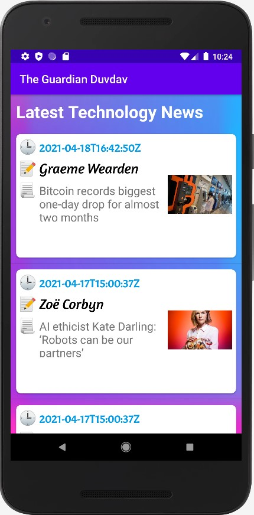
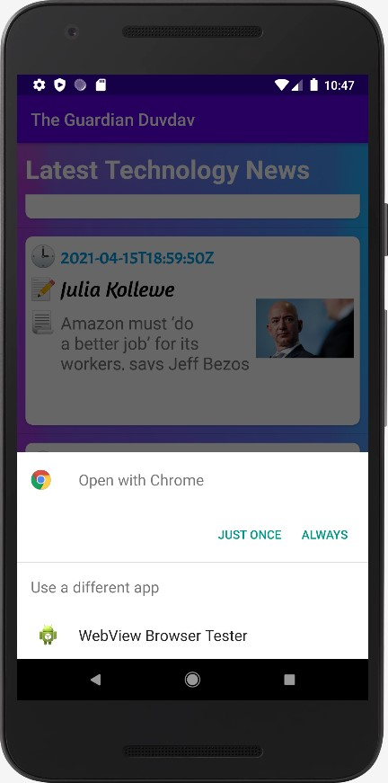

# The-Guardian-Duvdav-App

### This application is a technology news viewer from the Guardian newspaper by API Guardian, and when the user clicks on the news in the application, he goes to the news page on the web

# 1- In Xml files:

## A- activity_main.xml:
#### 1 RelativeLayout
#### 3 TextView
#### 2 ImageView
#### 1 ProgressBar

## B- guardian_list.xml:
#### 5 LinearLayout
#### 1 CardView
#### 6 TextView
#### 1 ImageView

## C- strings.xml:
#### 10 Strings I added them

# 2- In Java files:

## Containing:
### A- MainActivity.java : Which links the Progress Bar, Listview, TextView, and ImageView to a Java file and calls inside it the functions of the loader, and it also has the function of checking the Internet, and in the file there is also the API link of the Guardian newspaper.

### B- AttachFiles.java : This file contains the Internet connection functions and to run the API Guardian newspaper, and the keys are attached to it in the form of JSON

### C- TheGuardianAdapter.java and TheGuardianNews.java : These two files contain Methods to display news lists in the form and design that I did

### D- TheGuardianLoader.java : This file contains Methods to save space and not duplicate activites when we rotate the screen while the app is running

# Photos for stages app:
## 1- Stage in app:

## 2- Stage in app:

## 3- Stage in app when I click on the news:

## 4- Stage transfer to the news page after clicking on it:

